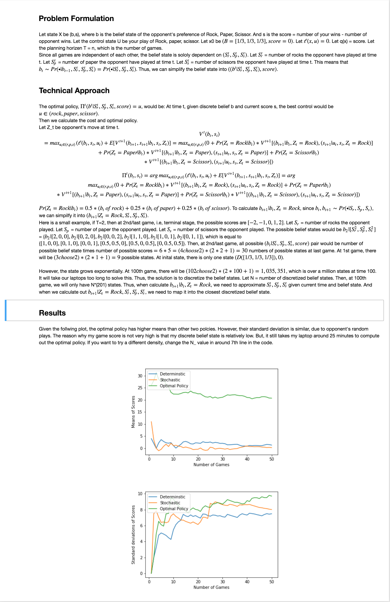

# Dynamic Programming

## Problem

Use Dynamic Programming to produce policy to win against a friend in a game of Rock-Paper-Scissors, knowing that your friend has 50% preference on one of the three options and 25% preference on other two. But you do not know which option that your friend has 50% preference on. 

## Hyper-parameters
T: Number of matches of Rock-Paper-Scissors in this game. (Default is 100)
N_: Density, Number of Total discretized belief states = (N_ * T). Higher N_, more accurate the model is.

## Report 
Screen Shot from report.ipynb

